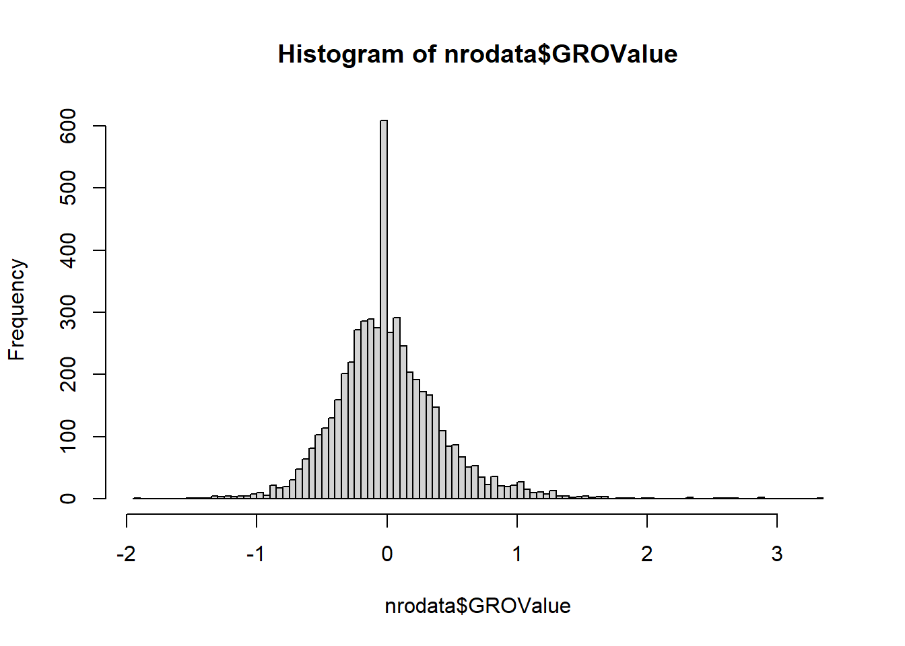

## Introduction

This is a first practical aiming at showcasing observed over expected frequencies

## The problem

Description of the problem


::: {.cell}

```{.r .cell-code}
1 + 1
```

::: {.cell-output .cell-output-stdout}

```
[1] 2
```


:::
:::


You can add options to executable code like this


::: {.cell}
::: {.cell-output .cell-output-stderr}

```
── Attaching core tidyverse packages ──────────────────────── tidyverse 2.0.0 ──
✔ dplyr     1.1.4     ✔ readr     2.1.5
✔ forcats   1.0.1     ✔ stringr   1.5.2
✔ ggplot2   4.0.0     ✔ tibble    3.3.0
✔ lubridate 1.9.4     ✔ tidyr     1.3.1
✔ purrr     1.1.0     
── Conflicts ────────────────────────────────────────── tidyverse_conflicts() ──
✖ dplyr::filter() masks stats::filter()
✖ dplyr::lag()    masks stats::lag()
ℹ Use the conflicted package (<http://conflicted.r-lib.org/>) to force all conflicts to become errors
```


:::
:::


The `echo: false` option disables the printing of code (only output is displayed).


::: {.cell}

```{.r .cell-code}
nrodata<-read.delim("C:/Users/chris/Dropbox/Data/GenomeUrbanizationPaper2017/SacCer2_All_NRO_values.tsv", header=T, sep="\t")
hist(nrodata$GROValue, breaks=100)
```

::: {.cell-output-display}
{width=672}
:::

```{.r .cell-code}
upratio<-length(which(nrodata$GROValue>=0))/length(nrodata$GROValue)
upratio
```

::: {.cell-output .cell-output-stdout}

```
[1] 0.5077577
```


:::
:::


::: {.cell}

```{.r .cell-code}
upratio
```

::: {.cell-output .cell-output-stdout}

```
[1] 0.5077577
```


:::
:::


